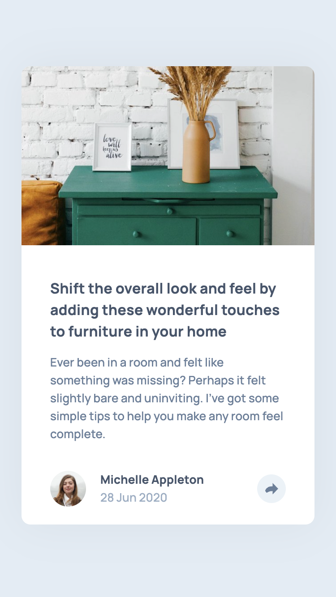
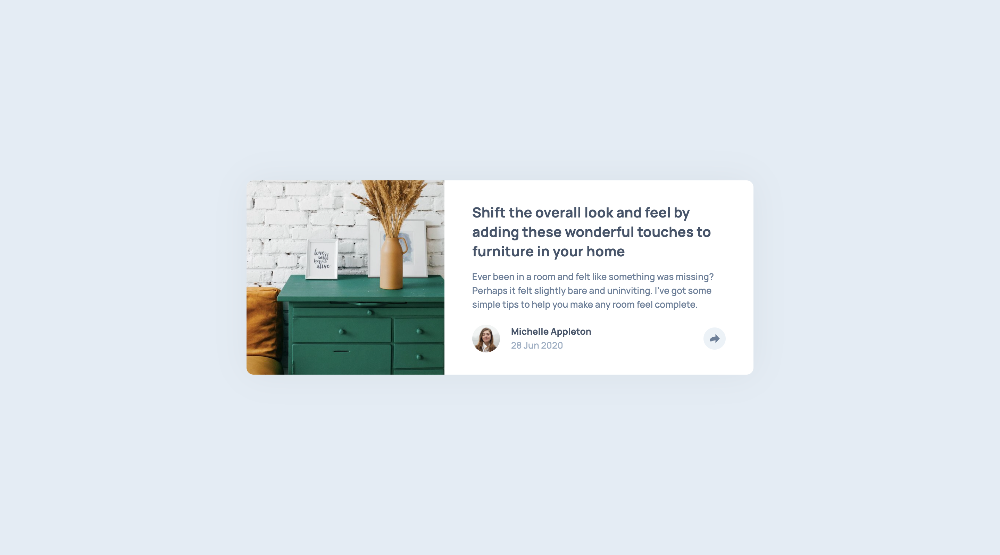
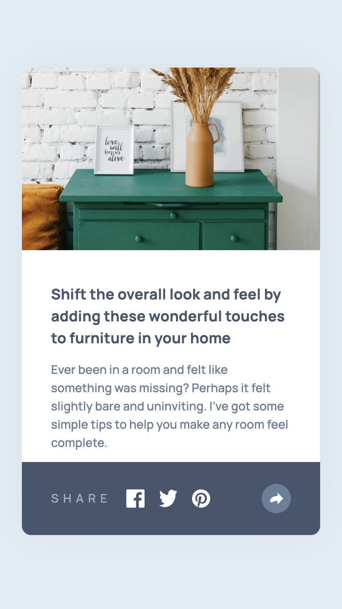
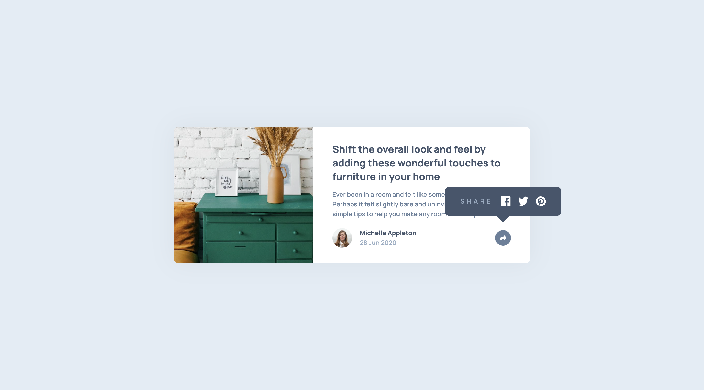

# Frontend Mentor - Article preview component solution

This is a solution to the [Article preview component challenge on Frontend Mentor](https://www.frontendmentor.io/challenges/article-preview-component-dYBN_pYFT). Frontend Mentor challenges help you improve your coding skills by building realistic projects.

## Table of contents

- [Overview](#overview)
  - [The challenge](#the-challenge)
  - [Screenshot](#screenshot)
  - [Links](#links)
- [My process](#my-process)
  - [Built with](#built-with)
  - [What I learned](#what-i-learned)
  - [Continued development](#continued-development)
  - [Useful resources](#useful-resources)
- [Author](#author)

## Overview

### The challenge

Users should be able to:

- View the optimal layout for the component depending on their device's screen size
- See the social media share links when they click the share icon

### Screenshot

|               Mobile designed at 375px:               |              Desktop designed at 1440px:               |
| :---------------------------------------------------: | :----------------------------------------------------: |
|               |               |
|                Mobile (active state):                 |                Desktop (active state):                 |
|  |  |

### Links

- Solution URL: [https://github.com/elisilk/article-preview-component](https://github.com/elisilk/article-preview-component)
- Live Site URL: [https://elisilk.github.io/article-preview-component/](https://elisilk.github.io/article-preview-component/)

## My process

### Built with

- Semantic HTML5 markup
- CSS custom properties
- Flexbox
- CSS Grid
- Mobile-first workflow
- Fluid typography

### What I learned

This task was nominally about a basic introduction to Javascript by implementing the reveal of the social media share links when the user clicks on the share icon. But the Javascript itself was super basic and didn't take long to implement.

On the other hand, the CSS that was needed to style the element that gets revealed felt much trickier than I first expected. In the mobile version, it wasn't that hard. But the desktop version gave me all kinds of difficulties such as the overflow, the stacking context, the positioning, the tail for the tooltip, etc. I'm not sure I have the best solution, or even an acceptable solution, but it seems to work decently well.

- [Javascript](https://www.digitalocean.com/community/tutorials/how-to-modify-attributes-classes-and-styles-in-the-dom)
- [Image sspect ratios](https://developer.mozilla.org/en-US/docs/Web/CSS/aspect-ratio)
- [CSS transform](https://developer.mozilla.org/en-US/docs/Web/CSS/transform)
- Grid and flexbox (as always)
- [Border radius](https://developer.mozilla.org/en-US/docs/Web/CSS/border-bottom-left-radius) and overflow
- [z-index](https://developer.mozilla.org/en-US/docs/Web/CSS/CSS_positioned_layout/Understanding_z-index) and [stacking contexts](https://developer.mozilla.org/en-US/docs/Web/CSS/CSS_positioned_layout/Understanding_z-index/Stacking_context) and a [helpful explainer video from Kevin Powell](https://www.youtube.com/watch?v=uS8l4YRXbaw&ab_channel=KevinPowell) to help me wrap my mind around the conditions in which different stacking contexts are triggered
- [SVG hover](https://css-tricks.com/change-color-of-svg-on-hover/) and the [different ways to use SVG in HTML markup](https://css-tricks.com/using-svg/)
- [Implementing CSS tooltips by Temani Afif](https://www.smashingmagazine.com/2024/03/modern-css-tooltips-speech-bubbles-part1/), or really just that little "tail" that goes at the bottom of the sharing panel when it gets revealed in the desktop version of the component. What a great site Temani has put together for [implementing so many variations on the CSS tooltip](https://css-generators.com/tooltip-speech-bubble/).
- [Hiding content visually in a way that it's still available to screen readers](https://www.a11yproject.com/posts/how-to-hide-content/)

### Continued development

I feel like there is so much to learn. Again, I was surprised that going into this challenge, I thought I would be learning about Javascript, but ended up focusing much more of my effort on the CSS.

And then when you start looking around, it leads you down so many other rabbit holes that it can get overwhelming. I finally watched [Andy Bell's "Be the browser’s mentor, not its micromanager" video](https://youtu.be/5uhIiI9Ld5M?si=ZCn2g4lwiIrW2aIi), and that led me to want to learn much more about so many things, like:

- [Every Layout](https://every-layout.dev/)
- [Cube CSS](https://cube.fyi/)

Kevin Powell is also still very much intriguing me with his accessible and easy-to-follow videos. I feel like he is manipulating me a bit, and always encouraging me to watch another one. Ugh! But it's still good content that makes it easy for a newbie like me to learn. He turned me onto the following that I want to check out further:

- [Create a blog with a headless CMS // Full 3-hour course // Astro + Wix Studio](https://youtu.be/Thudicbgqtg?si=jZkSTC0iWbrBzTCL)
- [Astro](https://astro.build/) - web framework for content-driven websites
- [Coollabs](https://fonts.coollabs.io/) - a privacy-friendly drop-in replacement for Google Fonts

### Useful resources

- [MDN Web Docs for CSS](https://developer.mozilla.org/en-US/docs/Web/CSS) - Went here a lot to reference the different CSS properties and the shorthands, and all the great explanations about best practices.

## Author

- Website - [Eli Silk](https://github.com/elisilk)
- Frontend Mentor - [@elisilk](https://www.frontendmentor.io/profile/elisilk)
